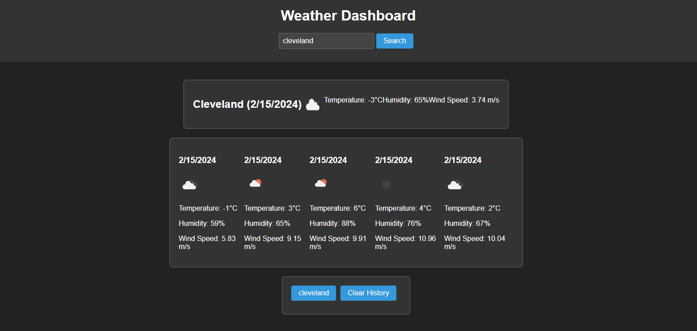

## Weather Dashboard

### Description

The Weather Dashboard is a web application that allows users to search for weather forecasts of multiple cities. It dynamically retrieves weather data from the OpenWeather API and displays current weather conditions as well as a 5-day forecast for the selected city. Users can also view their search history and clear it if desired.

### Features

- Search for weather forecasts of multiple cities
- View current weather conditions including temperature, humidity, and wind speed
- See a 5-day forecast with details like date, temperature, humidity, and wind speed
- Search history functionality to quickly revisit previous searches
- Option to clear search history

### Technologies Used

- HTML5
- CSS3
- JavaScript
- OpenWeather API

### Installation

1. Clone the repository:

git clone https://github.com/OpalSnellneberger/weather-dashboard.git

2. Navigate to the project directory:

cd weather-dashboard

3. Open the `index.html` file in your web browser.

### Usage

1. Enter the name of a city in the input field.
2. Click the "Search" button or press Enter.
3. View the current weather and 5-day forecast for the selected city.
4. To view the weather for a previous search, click on the city name in the search history.
5. To clear the search history, click the "Clear History" button.

### Deployment

The Weather Dashboard is deployed and accessible at [https://OpalSnellneberger.github.io/weather-dashboard/](https://OpalSnellneberger.github.io/weather-dashboard/).

### Credits

- Weather data provided by [OpenWeather](https://openweathermap.org/)
- Icons from [Flaticon](https://www.flaticon.com/)

### License

This project is licensed under the [MIT License](LICENSE).
